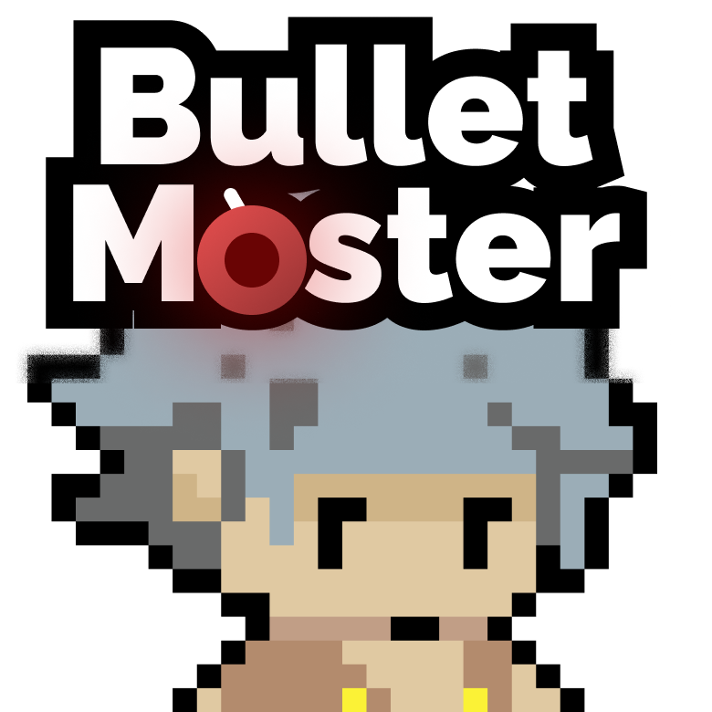

<div style="display: flex; align-items: center;">
  
  <h1 style="margin: 0;">Bullet Master</h1>
</div>


### Projet transverse L1 [2024]

## Description
Bullet Master est un jeu vidéo ou le but est de survivre le plus longtemps possible face à un cannon volant vous tirant dessus et des flèches venant des côtés sur fond d'un décor de l'école d'ingénieur EFREI Paris.

## Dépendances

Pour lancer ce programme vous aurez besoin de :
- Python 3.8
- Pygame 2.0.1

## Installation

1) Téléchargez le projet
```bash
git clone https://github.com/taonix/BulletMaster.git
```
2) Installez les dépendances
```bash
pip install pygame
```
3) Lancez le jeu
```bash
python EventHandling.py
```
